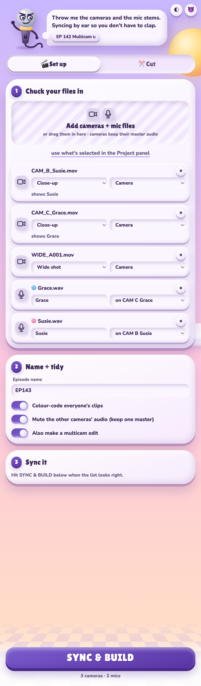
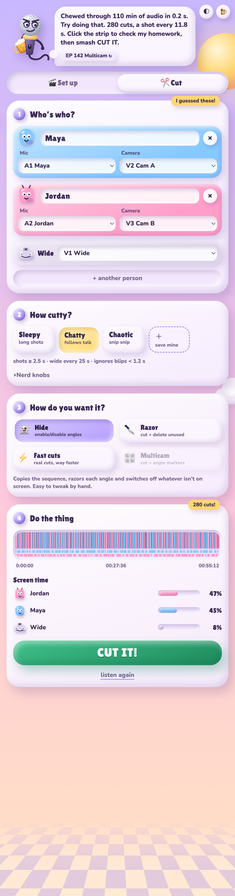
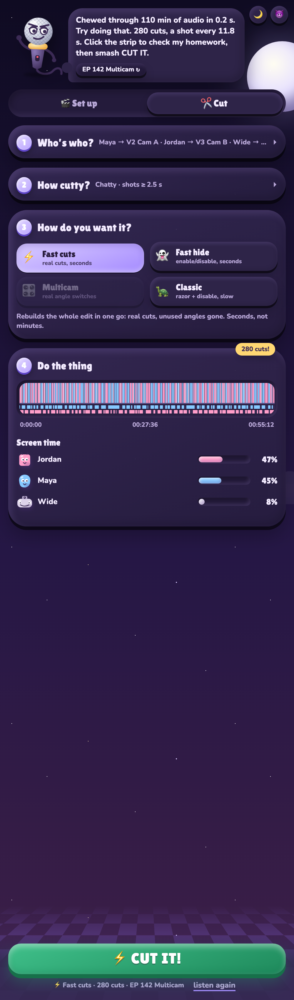
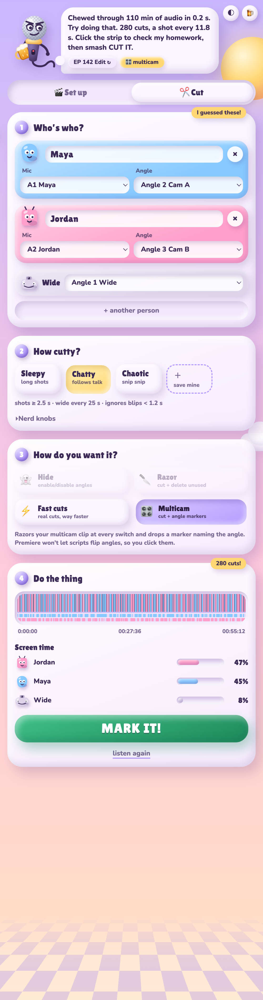

# Arrow Switch

Automatic multicam podcast editing for Adobe Premiere Pro (2022 and newer).
Arrow Switch syncs everyone's mic to the cameras, listens to who is talking, and cuts
between their cameras — with wide shots for cross-talk and long monologues. It is run by a
talking microphone, and it will be rude to you (there's a nice mode).

| Set up + sync | Cut | Dark mode | Multicam |
|---|---|---|---|
|  |  |  |  |

## For users

**Install (Mac, recommended):** paste this into Terminal. It installs the latest release for
your user and needs no admin password:

```bash
curl -fsSL https://raw.githubusercontent.com/erinuckuzular-ai/arrow-switch/main/install.sh | bash
```

Or download `Arrow-Switch-<version>.dmg` from the [latest release](https://github.com/erinuckuzular-ai/arrow-switch/releases/latest)
and run **Install Arrow Switch**, the app in the disk image: one button, no admin password, and it
quits Premiere for you. `Install Arrow Switch.pkg` is still there for a system-wide install (it does
ask for a password). Everything is signed with a Developer ID and notarized, so nothing is blocked
by Gatekeeper.

Restart Premiere Pro, then open **Window → Extensions → Arrow Switch**.

**Set up a new episode** (Set up tab)
1. Drop in the camera files (with their master audio) and each person's mic file. Arrow Switch
   works out which is which; set the wide shot and who each camera shows.
2. **SYNC & BUILD**: it syncs every file by audio, imports them into a bin, colour-labels each
   person's clips, mutes the extra camera audio and builds the sequence ready to cut. With
   **Also make a multicam edit** on, it also nests that sequence with Multi-Camera switched on,
   ready for 🎛 Multicam.

   Cameras and mics are matched by name, not the order you add them: a file called
   wide/WS/master is the wide, and `Chloe.wav` goes with `CamChloe.mp4`. Check the guesses in the list.

**Cut it** (Cut tab)
1. Check who's who (it guesses from the tracks).
2. Pick a preset (Sleepy / Chatty / Chaotic) or tweak the knobs and **save your own**.
3. Pick how you want it:
   - **⚡ Fast cuts**: rebuilds the edit in one import. Real cuts, unused angles gone. Seconds.
   - **⚡ Fast hide**: same speed, every angle kept, split at each switch and disabled when off screen.
   - **🎛 Multicam**: for multicam (or nested) sequences. Cuts the multicam clip at every switch
     and sets the **real angle** on each piece, so they stay live multicam clips you can re-switch.
     Premiere can't set angles from a script, so Arrow Switch saves the project, writes the
     angles into the project file (a backup copy goes to `~/Library/Caches/Arrow Switch/project-backups`)
     and reopens it — you'll see the project close and reopen for a second.
   - **🐢 Classic**: the original razor + disable inside Premiere. Same result as Fast hide, slower.

   Arrow Switch never cuts to a camera that has no footage at that moment (late-starting or
   early-stopping cameras): those shots use the wide, or whichever camera is rolling.
4. Extras (all optional):
   - **🎭 Reaction shots**: a quick cut to whoever laughs or goes "no way" while someone else
     is talking, then straight back. You set how often at most.
   - **✂️ Trim dead air** (Fast cuts / Fast hide): removes silences longer than your threshold
     from every track, keeping a breath either side. Nobody's words are ever trimmed.
   - **🔥 Best clips**: finds the liveliest 30–75 s stretches (reactions, quick back-and-forth,
     energy) and lists them. Click one to jump there; they're also added as markers on the new sequence.
5. **LISTEN!**, check the preview (gold = best clips, dark = dead air, notches = reactions;
   click it to jump there in Premiere), then **CUT IT!**

Arrow Switch always saves your project first and works on a new sequence
(`<name> – Arrow Switch`); your original is never changed. ⌘/Ctrl+Enter does the next step.
Theme (auto/light/dark) and tone (mean/nice) are the two buttons top right.

Windows: the disk image's **Everything else** folder holds `Arrow Switch.zxp`; install it with a
ZXP installer and put `ffmpeg.exe` in the extension's `bin` folder. That folder also holds the
`.pkg`, the uninstaller and the licences.

## For developers

```
extension/            the CEP panel that ships to users
  CSXS/manifest.xml   extension manifest (bump ExtensionBundleVersion to release)
  index.html, css/    panel UI
  js/engine.js        speaker detection + edit decisions (pure JS, unit tested)
  js/audio.js         ffmpeg decoding -> loudness per window, caching, media probing
  js/sync.js          audio sync: finds each file's offset against a reference camera
  js/xmlcut.js        Fast cuts: rewrites an exported FCP XML sequence into real cuts
  js/prproj.js        real multicam angles: sets SelectedTrackIndex in the project file
  js/presets.js       built-in + saved presets
  js/copy.js          everything the mascot says, mean and nice
  js/main.js          UI logic; runs in demo mode when opened in a normal browser
                      (?state=empty|analyzing|result|done|setup|syncing|synced, &theme=dark, &mc=1, &tone=nice)
  fonts/              Lilita One + Nunito (SIL OFL), bundled so it works offline
  jsx/host.jsx        ExtendScript: reads the sequence, clones it, razors, disables clips
installer/app/        the installer app (SwiftUI, built by scripts/build-installer-app.sh)
installer/art/        background and icon artwork, rendered by scripts/make-installer-art.sh
installer/            pkg scripts, installer pages, uninstaller, read me
test/                 node --test suites
build.sh              tests -> universal ffmpeg -> signed ZXP -> .pkg -> .dmg
```

### Accuracy benchmark

```bash
node test/bench/accuracy.js
```

Generates synthetic podcasts with known answers (mic bleed, a quiet guest, rumble,
backchannels, cross-talk, a two-channel recorder) and scores the engine: time on the
right camera, wrong shots, missed turns, cut timing and listen speed. Pass a folder
holding another `engine.js` + `audio.js` to compare versions.

### Build the DMG

```bash
./build.sh
```

Output: `dist/Arrow-Switch-<version>.dmg`. The first run downloads a static
universal ffmpeg and Adobe's ZXPSignCmd into `.cache/`, and creates a
self-signed ZXP certificate in `certs/` (keep it; reuse it for updates).

### Signing and notarizing the release

Releases are signed with a Developer ID and notarized, so macOS opens them without a
warning. Without these variables `build.sh` still produces a working but unsigned build
that users must right-click → Open. Store the notary credentials once (an App Store
Connect API key avoids app-specific passwords):

```bash
xcrun notarytool store-credentials arrow-switch-notary \
  --key ~/Downloads/AuthKey_KEYID.p8 --key-id KEYID --issuer ISSUER-UUID
```

Then build:

```bash
INSTALLER_SIGN_ID="Developer ID Installer: Your Name (TEAMID)" \
APP_SIGN_ID="Developer ID Application: Your Name (TEAMID)" \
NOTARY_PROFILE=arrow-switch-notary \
./build.sh
```

Apple's notary service takes a few minutes per file; `build.sh` waits and staples the
tickets, so the DMG and .pkg validate offline. Check a build with
`spctl -a -vvv -t install dist/Arrow-Switch-<version>.dmg` (expect `source=Notarized Developer ID`).

### Test inside Premiere without clicking

`scripts/harness/install.sh` installs the real panel as a hidden extension that starts with
Premiere (bring Premiere to the front once) and exposes it on the CEP debug port 8089.
`node scripts/harness/es.js '<ExtendScript>'` runs ExtendScript in Premiere and
`node scripts/harness/es.js --js '<panel JS>'` runs code in the panel, e.g. clicking its buttons.
Remove it with `rm -rf ~/Library/Application\ Support/Adobe/CEP/extensions/com.arrow.switch.harness`.
`scripts/dev-install.sh` installs the working copy as the normal visible panel (signed, with
remote debugging on port 8088).

### Develop live inside Premiere

Enable unsigned extensions once, then symlink the source folder:

```bash
defaults write com.adobe.CSXS.12 PlayerDebugMode 1
ln -s "$PWD/extension" ~/Library/Application\ Support/Adobe/CEP/extensions/com.arrow.switch
```

Restart Premiere. Debug with Chrome at http://localhost:8088 (see `extension/.debug`).
Preview just the UI in a browser: `python3 -m http.server -d extension` (demo mode).

### Licensing note

Arrow Switch's own code is MIT licensed (see `LICENSE`). Bundled third-party parts keep their own licenses:

The bundled ffmpeg is a GPLv3 build. Arrow Switch runs it as a separate program, and every
release ships `licenses/` (GPL text + `FFMPEG-NOTICE.txt`) in the extension and the DMG.
`build.sh` also drops the ffmpeg source and its build scripts into `dist/`: **attach
`ffmpeg-9.0.1.tar.xz` and `ffmpeg-build-script.tar.gz` to every GitHub release** next to the DMG.
If you swap in a different ffmpeg build, update `FFMPEG_VERSION` in `build.sh` and the notice.

Fonts: Lilita One and Nunito, SIL Open Font License 1.1 (`extension/fonts/FONTS-LICENSE.txt`).
