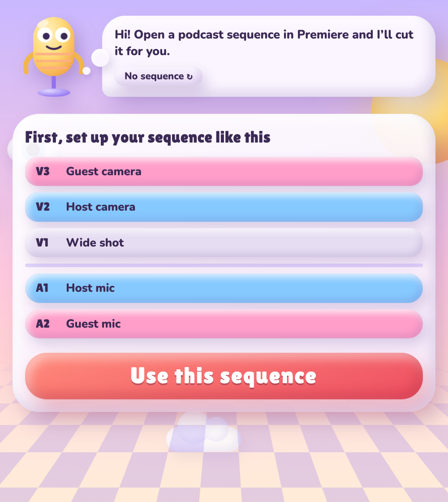
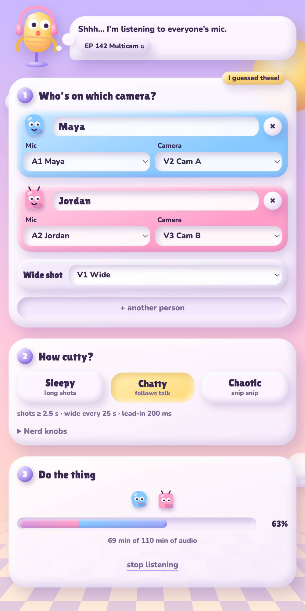
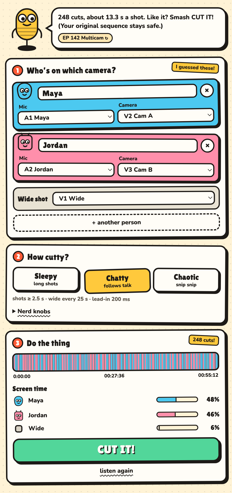
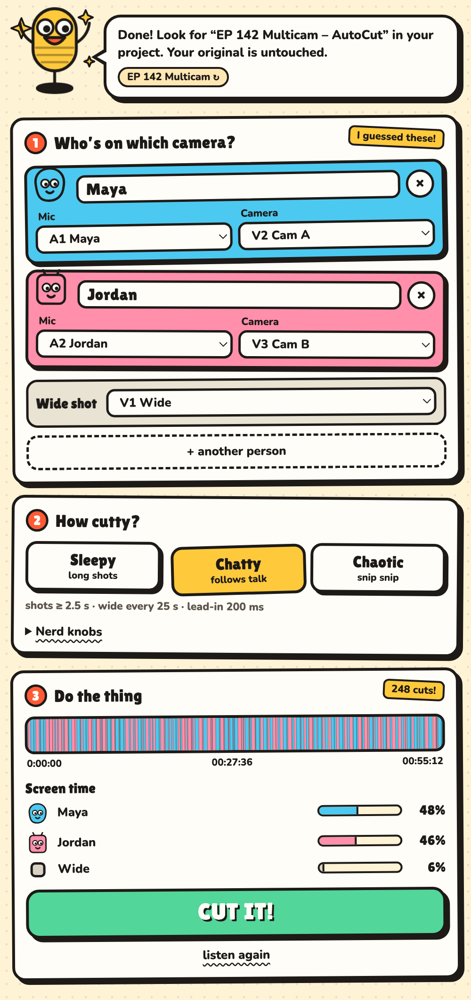

# Arrow AutoCut

Automatic multicam podcast editing for Adobe Premiere Pro (2022 and newer).
AutoCut listens to each person's mic, works out who is talking, and cuts
between their cameras — with wide shots for cross-talk and long monologues.

| Set up | Listening | Preview | Done |
|---|---|---|---|
|  |  |  |  |

## For users

**Download:** grab `Arrow-AutoCut-<version>.dmg` from the [latest release](https://github.com/erinuckuzular-ai/arrow-autocut/releases/latest).

1. Open `Arrow-AutoCut-<version>.dmg` and run **Install Arrow AutoCut.pkg**.
2. In Premiere: **Window → Extensions → Arrow AutoCut**.
3. Sequence layout: one camera per video track (e.g. V1 wide, V2 host, V3 guest)
   and one mic per audio track (A1 host, A2 guest), all synced.
4. Pick how cutty (Sleepy / Chatty / Chaotic), hit **LISTEN!**, then **CUT IT!**

AutoCut duplicates your sequence (`<name> – AutoCut`) and disables the unused
angle on each cut, so every shot can be flipped back on by hand.

Windows: install `Arrow AutoCut.zxp` with a ZXP installer and put `ffmpeg.exe`
in the extension's `bin` folder.

## For developers

```
extension/            the CEP panel that ships to users
  CSXS/manifest.xml   extension manifest (bump ExtensionBundleVersion to release)
  index.html, css/    panel UI
  js/engine.js        speaker detection + edit decisions (pure JS, unit tested)
  js/audio.js         ffmpeg decoding -> loudness per 100 ms
  js/main.js          UI logic; runs in demo mode when opened in a normal browser
                      (?state=empty|analyzing|result|done jumps to a screen)
  fonts/              Lilita One + Nunito (SIL OFL), bundled so it works offline
  jsx/host.jsx        ExtendScript: reads the sequence, clones it, razors, disables clips
installer/            pkg scripts, installer pages, uninstaller, read me
test/                 node --test suites
build.sh              tests -> universal ffmpeg -> signed ZXP -> .pkg -> .dmg
```

### Build the DMG

```bash
./build.sh
```

Output: `dist/Arrow-AutoCut-<version>.dmg`. The first run downloads a static
universal ffmpeg and Adobe's ZXPSignCmd into `.cache/`, and creates a
self-signed ZXP certificate in `certs/` (keep it; reuse it for updates).

### Distributing without Gatekeeper warnings

Unsigned installers make macOS say the developer can't be verified (users can
right-click → Open). To remove that you need an Apple Developer account:

```bash
xcrun notarytool store-credentials autocut-notary --apple-id you@example.com --team-id TEAMID
INSTALLER_SIGN_ID="Developer ID Installer: Your Name (TEAMID)" \
APP_SIGN_ID="Developer ID Application: Your Name (TEAMID)" \
NOTARY_PROFILE=autocut-notary \
./build.sh
```

### Develop live inside Premiere

Enable unsigned extensions once, then symlink the source folder:

```bash
defaults write com.adobe.CSXS.12 PlayerDebugMode 1
ln -s "$PWD/extension" ~/Library/Application\ Support/Adobe/CEP/extensions/com.arrow.autocut
```

Restart Premiere. Debug with Chrome at http://localhost:8088 (see `extension/.debug`).
Preview just the UI in a browser: `python3 -m http.server -d extension` (demo mode).

### Licensing note

The bundled ffmpeg build is GPL. Selling AutoCut with it bundled requires
complying with the GPL (or switching to an LGPL-only ffmpeg build).
